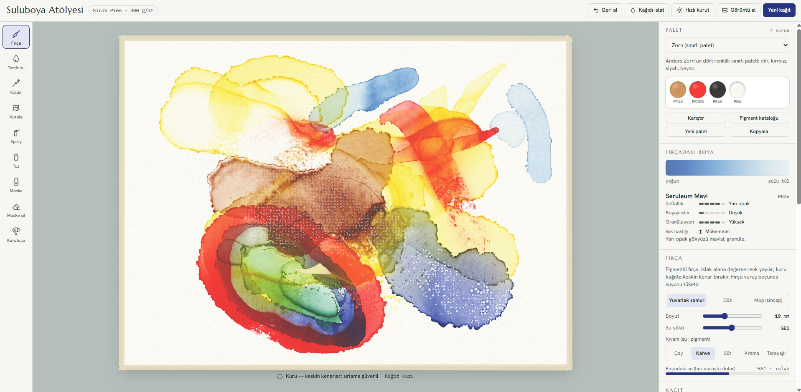

# Suluboya Atölyesi

Tarayıcıda çalışan, fizik tabanlı interaktif bir suluboya simülatörü.

**Canlı sürüm:** https://erenciracioglu-dotcom.github.io/suluboya-atolyesi/

Boya bir görüntü filtresi değil, GPU üzerinde (WebGL2) çalışan bir simülasyon: kağıdın üstünde akan su, kağıdın emdiği nem, suda yüzen ve kağıda oturmuş pigment ayrı ayrı hesaplanır. Renkler Kubelka–Munk modeliyle gerçek boya gibi karışır.

## Neler var

- **Gerçekçi davranış:** kuruyan lekelerde koyu kenar halkası, çiçeklenme (backrun), ıslak üstüne ıslak yayılma, granülasyon, sırlama (glaze)
- **İleri teknikler:** iri ve ince tuz, saç kurutma makinesi ve hızlı kurutma, kaldırma (lifting), kağıt havluyla kurulama, sprey, maskeleme sıvısı
- **Masa ve ortam:** kağıt eğimi (su aşağı akar), ortam nemi, zaman hızı
- **Fırça:** yuvarlak samur, düz, mop; su yükü ve kıvam (çay → tereyağı); fırça vuruş boyunca suyunu tüketir, kuru fırça dokusu kendiliğinden oluşur
- **6 kağıt:** soğuk pres, sıcak pres, kaba (rough), 640 g/m² ağır, selüloz öğrenci kağıdı, kozo (washi)
- **34 profesyonel pigment** renk indeksi kodlarıyla (PB29, PV19…), şeffaflık, boyayıcılık, granülasyon ve ışık haslığı bilgisiyle
- **7 hazır palet** (Zorn, Manzara, Botanik, Granülasyon seti…) ve kendi paletini oluşturma, karışımları palete kaydetme

## Kullanım

Tek bir HTML dosyası; kurulum ya da sunucu gerekmez. `index.html` dosyasını güncel bir tarayıcıda (Chrome, Edge, Firefox, Safari) açmanız yeterli. WebGL2 destekli bir ekran kartı gerekir.

Kısayollar: `B` fırça, `W` temiz su, `L` kaldır, `K` kurula, `S` sprey, `T` tuz, `M` maske, `E` maske sil, `D` kurutucu, `[` / `]` boyut, `Ctrl+Z` geri al.
